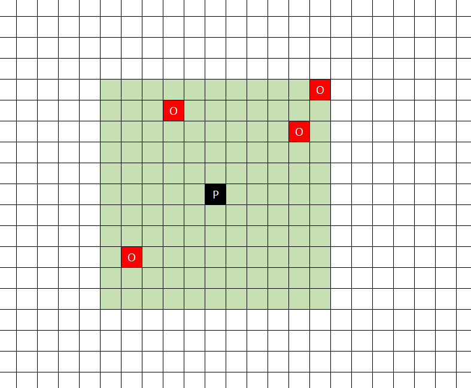

<p align="center">
  <a href="#0">
    
  </a>
  <br>
  <strong>Official C# SDK for interacting with Vikebot Challenge, a competitive online coding game.</strong>
  <br>
  <br>
  <a href="https://travis-ci.org/vikebot/vikebot-csharp">
    
  </a>
  <a href="https://coveralls.io/github/vikebot/vikebot-csharp?branch=master">
    
  </a>
</p>

## Join your game
**Prerequirements:**
* Registered Vikebot Challenge account
* Joined a game at your dashboard
* Visual Studio solution
* Install `vikebot` over Nuget

**Start coding:**

Before we start, we need to add a `using vikebot;` to the head of your file. Afterwards we create a new `Game` instance, which will establish a connection to the host server, authorize you and upgrade from plain to AES encrypted communication. The constructor takes your `authCode` which can be copied from your dashboard.
```csharp
using vikebot;

class Example
{
    static void Main(string[] args)
    {
        using (Game g = new Game("yourAuthCode"))
        {
            Player playerInstance = g.Player;
            
            int opponentsInMyArea = playerInstance.Radar();
        }
    }
}
```

**See your results:**

If you want to see a graphical representation of the game's current state (e.g. your player moving while you execute your bot code) you can use the open websocket protocol to receive special preprossed data that can be easily rendered. For all people who don't want to do this on their one we have a reference implementation running in the browser on https://watch.vikebot.com/watch-token. The `watch-token` can again be copied from your dashboard.

### `playerInstance.Radar()`
This command can be used to determine the amount of people within the player's action area. The value is returned as `int`. The zone is a 11x11 matrix with the player in it's center.
<br><br>
